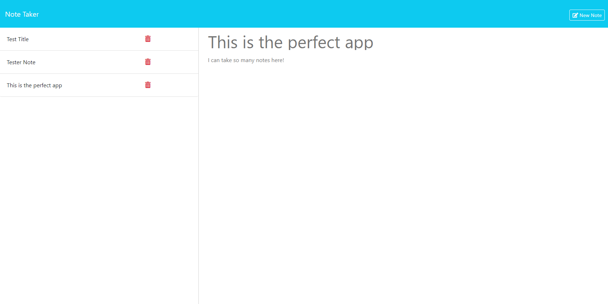

# Express-Note-Taker

Express Note Taker is an application was created to make writing and saving of notes easy and accessible. It is powered by Express.js on the backend and uses a json file to store the notes.

- Helps you keep your notes organized and saved in one plavce.

- Exsiting notes are listed ohn the left.

- If you wish to add newnotes that would be done on the right side of the page.

- New notes will be saved along side your existing ones.

- Made easy to clear existing notes when they are no longer needed.

- SSelecting an existing note will show it displayed on the right side.

- "New Note" button makes adding new notes a breeze.

## Installation

To install Express Note Taker:

- Clone the repository: https://github.com/Justino11247/Express-Note-Taker

- Go to the project directory

- Launch the terminal and execute the following command: `npm install`

## Usage

- Run the following command in your terminal to use Note-Again: `node server.js`

- Once connected to the server, open your browser and go to http://localhost:3001 to access the application.

[Link to Deployed Website](https://express-note-taker-ze7i.onrender.com)